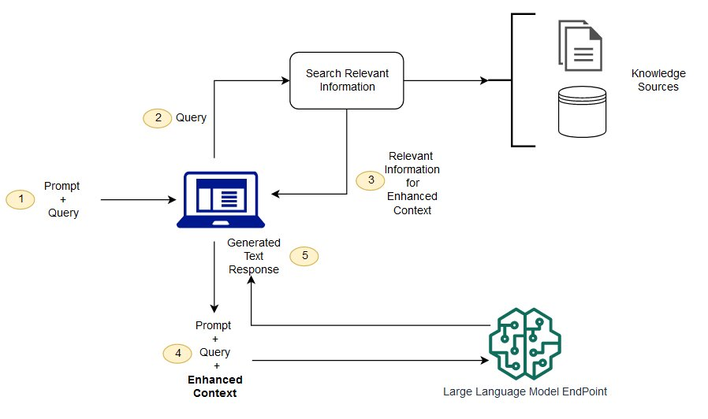
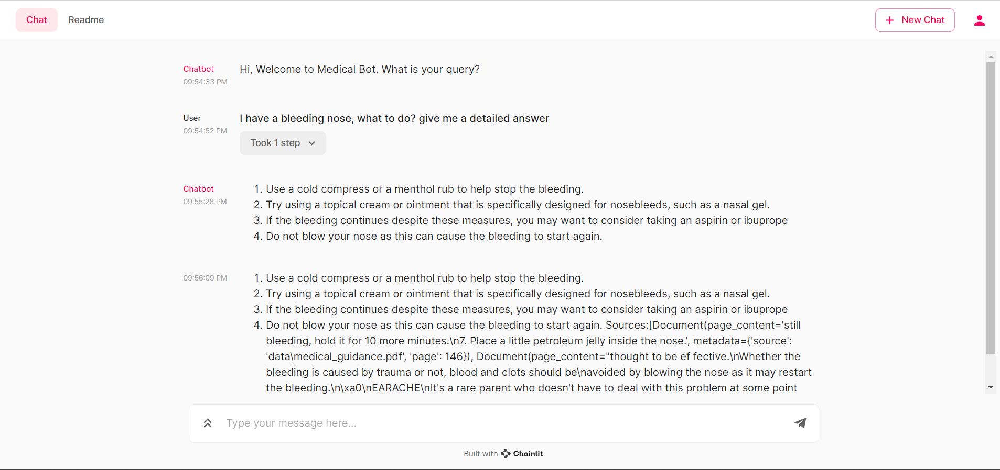

# Camino de Santiago Expert 👣🌍

Welcome to the Camino de Santiago 🤖 Expert, your trusted companion for your pilgrimage journey! Our chatbot is here to empower you with knowledge and solutions that not only enhance your travel experience but also contribute to a sustainable world. Whether you have questions about the Camino routes or seek insights into local culture and history, we've got you covered. Join us on a journey to explore the Camino de Santiago, making a positive impact every day.

## Tech Stack

Our Camino de Santiago Expert leverages the following technologies to provide an innovative and efficient service:

- **FAISS (Facebook AI Similarity Search):** For efficient similarity search and clustering of dense vectors.
- **LangChain:** To facilitate the creation and management of language applications.
- **Llama 2:** Utilized for its powerful language model capabilities.
- **Chainlit:** For building and deploying interactive, data-driven web applications.

This combination of technologies ensures that our chatbot is not only responsive and knowledgeable but also capable of understanding and processing complex queries with ease.

## What You Will Learn

This workshop is intentionally hands-on. By the end, participants will understand:

- **Embeddings 101:** how Camino PDFs become searchable vectors.
- **Vector stores:** how FAISS stores and retrieves chunks for grounding.
- **Mini AI agents:** how a Query Refiner, Document Coach, and Retrieval QA agent collaborate.
- **Hallucination control:** why prompts explicitly reference sources and when to admit “I don’t know.”
- **Local-first workflows:** running Llama 2 + FAISS on CPU-only laptops.

Use the live Chainlit UI to watch each agent step print to the chat so learners connect theory to execution.

## Quickstart

1. **Install dependencies**

   ```bash
   pip install -r requirements.txt
   ```

2. **Ingest Camino PDFs into FAISS**

   ```bash
   python ingest.py && ls vectorstore/db_faiss
   ```

   The second command confirms that the FAISS index now exists before opening the UI.

3. **Launch the Chainlit classroom UI**

   ```bash
   chainlit run app.py
   ```

   Ask a Camino question and watch each agent announce what it learned.

## Retrieval Augmented Generation

We are using a methodology called Retrieval Augmented Generation:



In RAG, the external data can come from multiple data sources, such as a document repository, databases, or APIs. 
- The first step is to convert the documents and the user query in the format so they can be compared and relevancy search can be performed. To make the formats comparable for doing relevancy search, a document collection (knowledge library) and the user-submitted query are converted to numerical representation using embedding language models. 
- The embeddings are essentially numerical representations of concept in text. Next, based on the embedding of user query, its relevant text is identified in the document collection by a similarity search in the embedding space. 
- Then the prompt provided by the user is appended with relevant text that was searched and it’s added to the context. 
- The prompt is now sent to the LLM and because the context has relevant external data along with the original prompt, the model output is relevant and accurate.

## Data Ingestion 

1. Gather Camino de Santiago PDFs and drop them into `data/`.
2. Run `python ingest.py` to split, embed, and store chunks in FAISS.
3. We use ***FAISS-CPU*** so every student laptop can follow along with semantic search.
4. Verify that `vectorstore/db_faiss` exists before running Chainlit.

## Langchain 🦜️🔗

LangChain is a framework for developing applications powered by language models. It enables applications that:

1. Are context-aware: connect a language model to sources of context (prompt instructions, few shot examples, content to ground its response in, etc.)
2. Reason: rely on a language model to reason (about how to answer based on provided context, what actions to take, etc.)
3. ***We are using Langchain to connect to LLM - LLAMA2***

## Llama 2 🦙

Llama 2 was pretrained on publicly available online data sources.
The fine-tuned model, Llama Chat, leverages publicly available instruction datasets and over 1 million human annotations.

- We are using the Llama2 with 7b (7 billion) parameters as our large language model, which takes the input query along with the context to get our desired result

## Mini Agent Architecture

To keep the learning experience interactive, the app now includes three lightweight agents that speak to students inside the Chainlit chat:

| Agent | What Students Observe | Skill Taught |
| --- | --- | --- |
| **Query Refiner** | Rewrites the question before retrieval | Planning + query rewriting |
| **Document Coach** | Summaries + citations from FAISS | Evidence gathering |
| **Retrieval QA** | Final grounded answer | Prompting + hallucination control |

Each message shows how the system reasons with documents before answering, reinforcing the RAG mental model.

## Chainlit 👋 (Gives User Interface)

Chainlit is an open-source Python package that makes it incredibly fast to build and share LLM apps. Integrate the Chainlit API in your existing code to spawn a ChatGPT-like interface in minutes!

- This integrates everything above and gives us a user interface, lets take a look at it below


